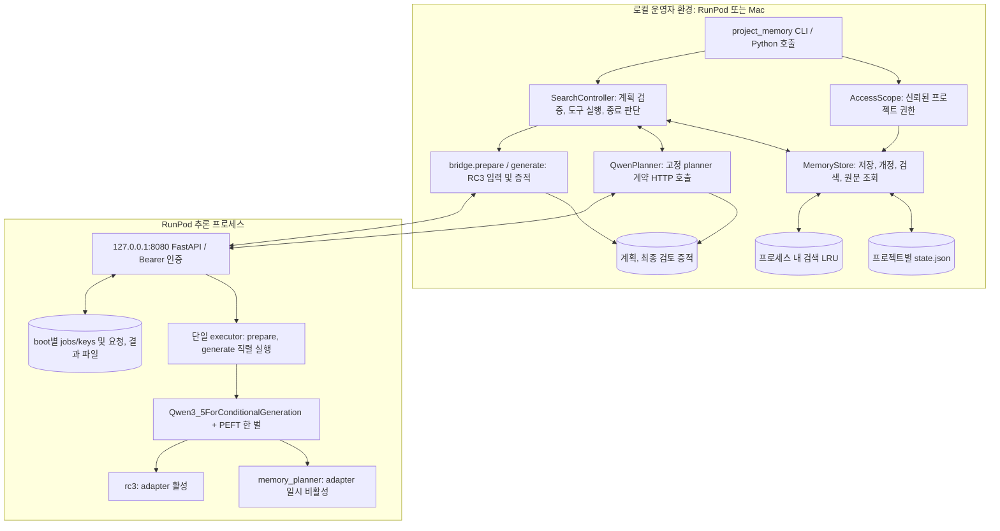
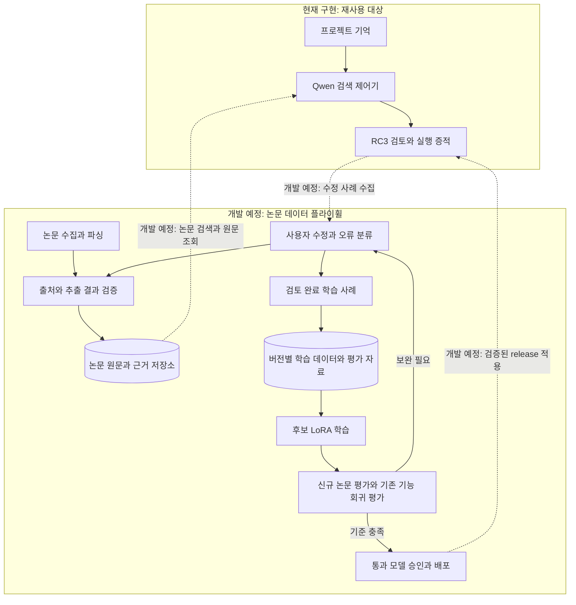

# DoriLab 아키텍처 명세서

문서 ID: `DORI-ARCH-001` | 버전1.0 | 2026-09-27 UTC.

기준 소스: [SOURCE_BASELINE.json](SOURCE_BASELINE.json). 필드 규격은 [입출력 명세](IO_SPEC_KO.md), 구현 책임은 [개발 명세](DEVELOPMENT_SPEC_KO.md)를 따른다.

구현 상태: §1~10은 현재 구현과 기존 검증 증적을 기술한다. §11의 논문 데이터 플라이휠은 **개발 예정**이며 구성 요소, 연결 방식, 개발 순서를 정의한다.

## 1. 목적과 현재 범위

프로젝트에 속한 관찰과 작업 이력을 영구 저장하고, 질문에 필요한 근거를 Qwen이 검색, 확인한 후 RC3 검토 모델에 전달한다. 근거의 프로젝트, scope, source revision, 원문 구간, 모델 입력, 출력을 추적할 수 있다.

현재 제공 형태는 **로컬 Python 라이브러리/CLI + loopback 추론 HTTP 서비스**다. 기억 CRUD는 로컬 Python/CLI로 수행한다. CLI의 project_id는 신뢰된 로컬 운영자가 지정한다. 다중 사용자 프로젝트 권한, 계정 서버, 웹 UI를 제공하려면 별도 계층을 구성해야 한다.

LongMemEval-V2 AgentRunbook의 세 기억 pool과 근거 수집 구조를 참고했다. 현재 검색 구성은 BM25와 한국어 bigram이다. 논문의 dense embedding, 멀티모달 검색, 임의 coding-agent 실행은 별도 구현이 필요한 기능이다. 현재 배포된 동작은 §1~10, 개발 예정 확장은 §11에 기록한다.

## 2. 구성도



Mac에서 실행하는 CLI의 기억 저장소는 Mac의 `--store` 경로다. RunPod의 기억 파일을 사용하려면 별도 저장소 연결이 필요하다. Mac→RunPod 추론 연결에는 기존 SSH 터널을 사용할 수 있다. 현재 증적은 RunPod 내부 검증 결과이며 Mac 실기 연결은 별도 검증 대상이다.

## 3. 구성 요소와 책임

| 요소 | 실제 구현 | 책임 |
|---|---|---|
| 운영자 CLI | [__main__.py](../../project_memory/__main__.py) | 파일 입력, 명령 실행, 제어기 선택, JSON 출력 |
| 기억 계층 | [store.py](../../project_memory/store.py) | 원본 검증, 저장, revision 전환, pool 생성, 검색, LRU, manifest/inspect |
| 제어기 | [controller.py](../../project_memory/controller.py) | baseline 검색, Qwen 계획 검증, 제한된 재검색, 원문 확인, fallback |
| 고정 planner 정책 | [planner_contract.py](../../project_memory/planner_contract.py) | 서비스 소유 system prompt와 계약 hash |
| 추론 연결 | [bridge.py](../../project_memory/bridge.py) | SourceReview packet 보강, HTTP 호출, model, memory receipt 연결 |
| HTTP 서버 | [server.py](../../inference/server.py) | 인증, readiness, 입력 크기, job admission, idempotency, 결과 조회 |
| GPU runtime | [model_runtime.py](../../inference/model_runtime.py) | 고정 모델 검증, 로드, native tokenization, adapter 전환, 생성 |
| launcher | [start_service.py](../../inference/start_service.py) | 중복 프로세스 방지, token 준비, API lock 확인, detached 시작 |

기억, 제어기 코드는 기본적으로 Python 표준 라이브러리를 사용한다. `--native-check`와 CPU PEFT 검사는 기존 GPU Python 환경의 processor/torch/PEFT를 재사용한다.

## 4. 정상 처리 순서

```mermaid
sequenceDiagram
    participant U as CLI/호출자
    participant C as SearchController
    participant M as MemoryStore
    participant H as 추론 HTTP
    participant G as 공유 Qwen GPU
    U->>C: question + trusted project + scope
    C->>M: baseline query
    M-->>C: snapshot version + evidence
    loop 제한 내 search / inspect / finish
        C->>H: POST /v1/generations (planner 계약)
        H-->>C: 202 + job ID
        H->>G: adapter 비활성 → generate → 복구
        C->>H: GET /v1/generations/{id}
        H-->>C: 계획 원문 + 실행 모드
        C->>C: 계획 schema/ID/횟수 검증
        C->>M: 허용된 query 또는 inspect
        M-->>C: 같은 snapshot의 근거, 원문
    end
    C-->>U: 최종 근거 묶음 + 제어 trace
    U->>U: bridge.prepare: observations 보강
    U->>H: POST /v1/generations (SourceReview 계약)
    H-->>U: 202 + job ID
    H->>G: adapter 활성 상태로 RC3 generate
    U->>H: GET /v1/generations/{id}
    H-->>U: 원문, token, hash, model receipt, boot_id
    U->>U: 증적 저장; 기억 갱신은 별도 입력
```

제어기 기본 흐름은 먼저 baseline을 검색한 뒤 Qwen에 후보를 전달한다. 각 생성 단계는 독립 HTTP transaction이며 GPU 사용권도 job 단위로 할당한다. 다른 클라이언트의 생성이 단계 사이에 들어올 수 있으며, 다음 job이 busy면429가 된다.

## 5. 한 벌의 모델을 사용하는 방법

| 항목 | 현재 값/동작 |
|---|---|
| 배포 모델 이름 | `Qwen/Qwen3.8-27B` |
| 실제 loader class | `Qwen3_5ForConditionalGeneration` |
| wrapper | PEFT `PeftModel` |
| base 경로 | `/root/models/qwen38-27b` |
| adapter 경로 | `/workspace/dorilab/models/qwen38-27b/current/adapter` |
| web worker / generation | 각각1개; busy 상태의 신규 요청은429 |
| planner | 고정 planner contract ID일 때만 `disable_adapter()` context 사용 |
| reviewer | 그 외 허용된 계약은 RC3 adapter 적용 |
| 추론 | BF16, SDPA, greedy, thinking=false, eval, gradient 비활성 |
| token 제한 | 입력+예약 응답≤4096, 예약 응답1..384 |

planner 진입 전 adapter enabled=True, context 안 False, 정상 반환 후 True를 검사한다. 예외 시 adapter 복구는 PEFT context manager의 finally에 의존하며 CPU 검사로 확인했다. 생성 예외가 발생하면 서비스 readiness도 실패로 전환되며 후속 job 접수에는 정상 복구가 필요하다.

두 실행 모드는 한 번 로드한 모델 객체와 base 가중치를 공유하며 RC3 LoRA를 별도 adapter로 유지한다. job 응답의 `execution_mode`와 `adapter_applied`가 사용한 실행 경로를 표시한다.

## 6. 기억과 검색 데이터 구조

영구 원본은 `<store>/<project_id>/state.json`이다. 파일에는 source별 trajectory revision과 활성 revision mapping이 함께 들어 있다. 세 pool은 조회할 때 이 파일에서 생성한다.

| pool | 생성 방식 | 의미 |
|---|---|---|
| raw | 각 step의 observation | 특정 시각의 기록된 관찰 |
| events | action이 있고 다음 observation과 달라진 연속 step 쌍 | before/action/after 기록; 인과관계는 별도 검증 대상 |
| notes | confirmed 메모와 참조 step 번호 | 작업 절차, gotcha, premise에 대한 작성자 확인 메모 |

scope는 unit_id/configuration_id/run_id 세 문자열의 정확한 일치로 제한한다. 시간 정보는 원본 보존과 판단 근거로 제공한다. 범용 사실 병합과 시점별 truth resolution에는 별도 구현이 필요하다. 최신 source revision 안에 과거 step이 함께 있으면 그 과거 관찰도 검색될 수 있다.

기억 변경은 CAS(expected_version)와 단일 호스트 flock으로 제어한다. 임시 파일 쓰기→fsync→atomic replace로 새 snapshot을 게시한다. 전체 snapshot hash는 오염 감지에 사용한다. 운영 범위는 단일 호스트의 로컬 파일 저장소다. 서명, 암호화, 여러 호스트의 writer, 외부 인증 DB, 원문 URI 다운로드에는 별도 구성이 필요하다.

## 7. 캐시와 수명

| 데이터 | 위치/범위 | 수명, 무효화 |
|---|---|---|
| trajectory 원본, revision | 영구 state.json | 명시적 변경까지 유지; withdraw는 활성 mapping만 제거 |
| 검색 결과 | MemoryStore 인스턴스 LRU, 기본64개 | project/version/question/scope/queries/예산이 같은 경우 재사용 |
| 구버전 검색 캐시 | 같은 LRU에 남을 수 있음 | 각 version은 독립 key를 사용하며 용량 초과 시 퇴출 |
| 제어기 계획 | 현재 호출의 Python 상태 + trace 파일 | 계획은 질의마다 새로 생성 |
| HTTP 결과, idempotency | 서버 jobs/keys 메모리 | 완료/실패 job을 created_at 기준24시간 후 lazy 만료; 재시작 시 lookup 소실 |
| HTTP 요청, 결과 파일 | `inference/run/<boot_id>` | API 만료와 무관하게 보존; 정리는 운영자 관리 |
| GPU KV/재귀 상태 | 해당 generate 호출 | past_key_values의 사용 범위는 해당 호출 |

torch allocator의 reserved memory는 할당자가 보유한 GPU 메모리다. KV 상태는 각 generate 호출 안에서 생성하고 사용한다. 현재 재사용 캐시는 기억 검색 LRU이며 GPU 생성은 요청별로 직렬 실행한다. prefix cache, 의미 기반 답변 캐시, continuous batching에는 별도 구현이 필요하다.

## 8. 인증과 신뢰 경계

AccessScope는 Python 호출자가 제공하는 신뢰된 권한 집합이다. CLI는 로컬 운영자 권한으로 단일 프로젝트 집합을 만든다. 다중 사용자 HTTP 공개에는 사용자→프로젝트 권한을 매핑하는 별도 인증 계층이 필요하다.

추론 HTTP는 하나의 서비스 Bearer token을 사용한다. `/version`, generation 제출과 조회에 필요하며 health 경로는 공개다. 같은 token의 호출자는 해당 boot의 job ID를 알면 결과를 조회할 수 있다. job 접근 권한은 서비스 token 단위로 적용한다.

planner 출력은 검증 대상 데이터다. 실행 가능한 도구는 검색과 이미 제시된 ID의 원문 확인으로 고정한다. 원문 속 지시나 action은 검색 데이터로 취급한다. 모델의 의미적 정확성은 별도 검증 대상이다.

`/workspace`는 영구 저장 위치다. 기밀성 확보에는 파일시스템 접근 권한 관리가 필요하다. token의 보관 위치는 `/root/.config/dorilab/inference.token`이며 기억과 trace에는 업무 데이터와 실행 증적을 저장한다.

## 9. 배포와 재시작 경계

`start_inference.sh`는 FD9를 닫고 start_service.py를 실행한다. launcher는 lock과 PID identity, 8080 bind 가능 여부를 확인하고 detached 프로세스를 시작한다. 시작 명령의 반환은 준비 완료와 다르므로 `/readyz`를 확인해야 한다.

정상 파일 검증, GPU 로드, RC3와 planner 기술 warmup 이후 ready가 된다. 기술 warmup은 짧은 생성의 실행을 확인한다. 계획 JSON의 유효성과 공학 성능은 별도 검증 대상이다.

| 영구 보존 대상 | 휘발/복구 대상 |
|---|---|
| workspace의 프로젝트 코드, adapter, memory_data, 증적, lock 파일 원본 | root의 GPU venv, base 모델, token, 현재 PID, GPU 모델, LRU, jobs |

root 초기화 후 모델과 venv 복구, RunPod Start Command의 정확한 구성은 기존 bootstrap의 책임이다. 이 명세는 현재 구성 요소의 동작과 기존 검증 증적을 기록한다. 새로운 Pod 초기부팅 전체는 별도 검증 대상이다. 모델 로드는 서비스 시작 때 수행한다.

## 10. 검증 상태

[기존 검증 receipt](../../project_memory/artifacts/controller_v1/verification.json) 기준: CPU33개, 서비스4개 통과. 합성 입력으로 실제 Qwen의 inspect→finish, search→inspect→finish, 이후 RC3 검토를 확인했다. planner의 adapter 비활성과 reviewer의 활성, 동일 boot/model receipt, raw hash, token 한도도 확인했다.

이 증적의 PID28751/boot_id는 당시 실행 snapshot이며 실행마다 달라진다. 현재 검증 범위는 위 CPU/서비스 검사와 합성 입력 흐름이다. 공식 LongMemEval-V2 점수, 공학 정확도, Mac 실기 연결, 다중 호스트 운영은 별도 평가 대상이다.

## 11. 논문 데이터 플라이휠 — 개발 예정

**상태: 개발 예정.** 여러 논문을 지속적으로 수집하고, 실제 검토 과정에서 얻은 수정 사례를 검증된 학습 데이터로 축적하는 확장이다. 이 절의 신규 구성과 연결은 개발 계획이며 검증 결과는 구현 후 별도 receipt에 기록할 예정이다.

### 11.1 지식 갱신과 모델 능력 갱신

| 경로 | 축적 대상 | 반영 조건 | 상태 |
|---|---|---|---|
| 논문 지식 갱신 | 원문, 실험 조건, 수치, 출처, 개정 이력, 상충 결과 | 문서 검증과 검색 등록 완료 | 개발 예정 |
| 모델 능력 갱신 | 근거 선택, 조건 비교, 자료 요청, 검토 판단의 검증된 사례 | 데이터 검증, 후보 학습, 평가 기준 통과, 배포 승인 | 개발 예정 |

논문은 문서, 절, 표, 실험 조건을 중심으로 별도 저장소에 관리할 예정이다. 프로젝트 작업 기억은 기존 trajectory 구조를 유지한다. 프로젝트별 허용 논문 집합과 문서 접근 범위를 지정하고, 검색 결과 단계에서 논문 근거와 프로젝트 기억을 결합할 예정이다.

### 11.2 예정 구성도



### 11.3 구성 요소와 기존 코드 연결

| 구성 요소 | 계획한 책임과 연결 | 상태 |
|---|---|---|
| 논문 수집 worker | PDF 파싱, DOI와 revision 식별, 원문 hash, 중복 처리, 작업 상태 저장 | 개발 예정 |
| 논문 저장소 | 원문과 추출 근거 보존, 페이지와 표 위치 추적, 프로젝트별 문서 접근 범위 | 개발 예정 |
| 검색 연결 | SearchController의 search/inspect/finish 흐름에 논문 검색과 원문 조회 인터페이스 연결 | 개발 예정 |
| 검토 연결 | 논문 근거를 bridge.prepare의 observations 형식으로 변환하고 출처 전달 | 개발 예정 |
| 피드백 저장소 | 질문, 검색 근거, 모델 원문, 사용자 수정, 오류 유형, 검토자 판정 연결 | 개발 예정 |
| 데이터셋 생성기 | 검토 완료 사례 선별, 기존 승인 학습 사례 혼합, 논문 계열별 분리, 데이터 버전 고정 | 개발 예정 |
| 학습 및 평가 runner | 후보 LoRA 생성, 신규 논문 평가, 기존 기능 회귀 평가, 결과 receipt 저장 | 개발 예정 |
| release 관리 | 후보와 운영 adapter의 hash 및 계보 관리, 배포 승인, 이전 release 복구 | 개발 예정 |

### 11.4 데이터와 검증 경계

논문 근거에는 논문 ID, revision, 원문 hash, 출처와 이용 조건, 페이지, 절, 표 번호, 원문 구간을 기록할 예정이다. 실험 근거에는 대상 재료나 장치, 실험 조건, 단위, 측정값, 저자의 결론, 적용 조건, 상충 관계를 함께 저장한다. 추출기 버전, 검토 상태, 검토자도 추적 대상이다.

학습 사례의 단위는 **질문 + 당시 검색 근거 + 모델 출력 + 검증된 수정 결과**로 정한다. Qwen 요약과 답변은 후보 상태로 저장하고 출처 대조와 검토를 통과한 사례를 학습 데이터로 승격할 예정이다. 검색 실패, 근거 해석 오류, 출력 형식 오류를 분류해 개선 대상에 연결한다.

학습 자료와 평가 자료는 논문 계열 및 개정판 단위로 분리할 예정이다. 데이터셋 버전에는 원문 revision, 사례 ID, 분리 기준, 검토 기록, 생성 코드 버전과 hash를 기록한다. 평가 항목은 출처 일치, 조건과 단위 해석, 상충 근거 처리, 자료 요청의 적절성, 여러 논문 비교, 기존 RC3 기능 유지로 구성할 예정이다. 평가 기준과 통과 임계값은 구현 단계에서 확정한다.

### 11.5 모델, 실행 자원과 배포

현재 검색 제어기는 base Qwen을, 검토 단계는 RC3 adapter를 사용한다. 후보 RC3 LoRA 학습의 직접 개선 대상은 검토 단계로 정한다. 검색 제어기 학습은 별도 데이터와 평가 경로를 갖추는 후속 개발 대상으로 둔다.

현재 전체4096token, 응답384token 한도를 기준으로 논문을 절과 근거 단위로 분할하고 필요한 원문을 선택하도록 연결할 예정이다. 기억 저장소의 snapshot32MiB 한도와 논문 저장소의 용량 정책은 각각 관리한다. 검색 캐시는 프로젝트 접근 범위, 논문 집합 버전, 검색기 버전과 질의 조건을 반영하도록 확장할 예정이다.

대량 논문 처리에는 작업 상태를 영구 저장하는 배치 worker를 마련할 예정이다. 현재 HTTP generation 동시성1과 boot 누적256job 제한을 고려해 처리량, 중단 후 재개, 호출 예산을 관리한다. GPU 학습은 별도 GPU 또는 예약된 학습 시간에 수행하는 방식으로 계획한다. CPU 수집과 파싱은 추론 및 GPU 학습과 독립된 작업으로 구성한다.

배포 단위는 base revision, adapter hash, 계약 버전, 데이터셋 버전과 평가 receipt를 연결한 release로 정할 예정이다. 평가를 통과한 후보는 승인 후 적용하며, 현재 서비스의 시작 시 모델 로드 방식과 readiness 검증에 맞춰 전환한다. 이전 release의 자산과 설정을 보존해 복구 경로를 마련한다.

### 11.6 개발 순서와 완료 기준

| 단계 | 개발 범위 | 완료 기준 | 상태 |
|---|---|---|---|
| 1 | 논문 등록, 파싱, 원문과 출처 저장 | 동일 문서 중복 처리, revision 추적, 페이지와 원문 구간 대조 | 개발 예정 |
| 2 | 논문 검색과 RC3 검토 연결 | 프로젝트 접근 범위, 출처 전달, token 예산 검증 | 개발 예정 |
| 3 | 사용자 수정과 학습 사례 저장 | 후보에서 검토 완료까지의 이력, 오류 분류, 사례 출처 추적 | 개발 예정 |
| 4 | 학습 데이터와 평가 자료 버전 생성 | 논문 계열 분리, 기존 승인 사례 혼합, hash와 생성 이력 재현 | 개발 예정 |
| 5 | 후보 학습, 평가, release 관리 | 평가 기준 통과, 배포 승인 기록, readiness 확인, 이전 release 복구 검증 | 개발 예정 |

첫 개발 범위는 단계1~4로 정한다. 이 경로를 통해 논문 활용 결과를 학습 자산으로 축적하고, 단계5에서 후보 LoRA 학습과 운영 배포를 연결할 예정이다.
