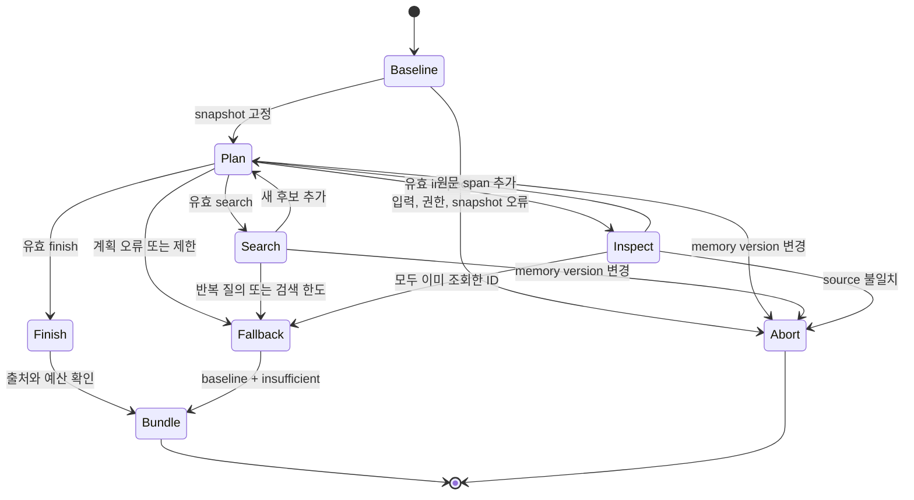

# DoriLab 개발 명세서

문서 ID: `DORI-DEV-001` | 버전1.0 | 2026-09-27 UTC | 현재 구현 기준.

이 문서는 [아키텍처](ARCHITECTURE_KO.md)와 [입출력 규격](IO_SPEC_KO.md)을 구현하는 모듈의 책임, 처리 규칙, 실행 전제, 검증 상태를 정의한다. 코드 기준선은 [SOURCE_BASELINE.json](SOURCE_BASELINE.json)이다. 기술 범위는 현재 배포된 기능이다.

## 1. 개발 범위와 결과물

| 기능 ID | 구현 기능 | 담당 코드 |
|---|---|---|
| MEM-01 | 프로젝트, scope 격리와 파일 snapshot | store.py |
| MEM-02 | trajectory 개정/CAS/중복/철회 | store.py |
| MEM-03 | raw/events/notes 생성 및 원문 구간 조회 | store.py |
| RET-01 | pool별 BM25 검색, whole-record 선택 | store.py |
| RET-02 | snapshot 기반 bounded LRU | store.py |
| CTL-01 | Qwen search/inspect/finish 계획 실행 | controller.py, planner_contract.py |
| CTL-02 | 계획 검증, 제한, baseline fallback | controller.py |
| BRG-01 | 검색 근거의 SourceReview packet 연결 | bridge.py |
| BRG-02 | HTTP 제출, 조회, 원문 증적 | bridge.py, controller.py |
| INF-01 | 단일 GPU 모델, adapter 실행 모드 | model_runtime.py |
| INF-02 | 인증, job, readiness, idempotency | server.py |
| OPS-01 | 단일 인스턴스 detached 시작 | start_inference.sh, start_service.py |

기억 CRUD는 로컬 호출 기능이다. 외부 사용자 계정과 프로젝트 ACL 서비스, 웹 UI, 범용 문서 수집기, 자동 note 추출기, 공식 LongMemEval 평가 실행기는 별도 구현이 필요한 기능이다.

## 2. 소스 구성

```text
project_memory/
  __init__.py                public store exports
  __main__.py                CLI commands and controller selection
  store.py                   persistent state, pools, BM25, LRU, inspection
  controller.py              plan validator, rules/Qwen planners, control loop
  planner_contract.py        pinned base-Qwen system policy
  bridge.py                  SourceReview preparation and HTTP submission
  test_memory.py             21 synthetic CPU regression tests
  test_controller.py         12 controller/PEFT regression tests
  examples/                  synthetic trajectory and packet
  artifacts/controller_v1/   existing tests and live run evidence
inference/
  server.py                  FastAPI application and job lifecycle
  model_runtime.py           sealed runtime serving bridge
  contracts/                 sealed system allowlist and service overlay
  service_config.json        service limits/token path
  requirements-api.lock      exact API dependency closure
  restore_api.py             lock verification/recovery
  start_inference.sh         FD9 closure and launcher entry
  start_service.py           singleton process launcher
  test_service.py            4 existing HTTP/runtime regression tests
  run/                       boot/job artifacts and process/log metadata
```

원본 RC3 tokenizer/processor 로직은 `results/v15_release_progress/cpu_rc3/tokenization.py`에서 필요한 함수를 serving bridge로 import하여 재사용한다. 학습과 평가 runner main은 별도 실행 경로다. `contracts()`는 봉인된 입력 artifact의 hash와 system 집합을 검증한다. planner 계약은 원본 allowlist를 보존하며 별도 고정 정책으로 추가한다.

## 3. 실행 환경과 고정 자산

| 항목 | 기준 |
|---|---|
| GPU Python | `/root/venvs/dorilab-tournament/bin/python` |
| 모델 식별자 | Qwen/Qwen3.8-27B |
| base revision | `1d4bf0f2ff6012fd82039f2fa52739d0dd7c60c0` |
| Transformers commit | `002e1edf5b5198488297f401dd853056b6521d02` |
| adapter weights SHA256 | `d90dee59f00f7c987c1b61ae334f928464bfb412ddb26110d692b92b9a46a689` |
| adapter config SHA256 | `d037e965c05ec56ed6069581635ada7f704a6c6331b56831075f127f52f61628` |
| 모델 class | Qwen3_5ForConditionalGeneration + PEFT |
| local core 의존성 | Python 표준 라이브러리; fcntl/Unix 파일, 프로세스 기능 사용 |
| API 의존성 | inference/requirements-api.lock의 exact pins |

API lock에는 FastAPI0.141.1, Uvicorn0.54.0, Pydantic2.13.5 등이 기록되어 있다. 전체 closure는 lock 파일을 기준으로 한다. 기억 계층은 Python 표준 라이브러리를 사용한다. 운영 전제는 RunPod/Linux와 Mac/Unix이며 Windows native 지원은 별도 검증 대상이다.

GPU runtime은 base 전체 shard의 실제 hash를 기존 CHECKPOINT_HASHES receipt와 비교하고 adapter 두 파일의 실제 SHA256을 확인한다. source receipt, tokenizer/template, 정확한 Transformers commit도 확인한다.

현재 주요 제한은 다음과 같다. 일부 값은 service_config.json 외에 runtime/bridge에도 중복 고정되어 있으므로 설정 변경 시 각 구현 위치를 함께 갱신해야 한다.

| 제한 | 기본값/상한 | 실제 구현 위치 |
|---|---|---|
| 전체 token / 응답 예약 | 4096 / 384 | model_runtime.py, server.py, bridge.py |
| HTTP body | 65,536byte | service_config.json, bridge.py |
| generation 동시성 / queue | 1 / 0 | server.py executor와 busy gate |
| boot 누적 job / lookup TTL | 256 / 86,400초 | service_config.json, server.py |
| planner 검색 | 기본3회, 설정1..3 | SearchController; baseline 포함 |
| planner 단계 | 기본6회, 설정1..8 | SearchController |
| planner 총 시간 | 기본90초, 설정1..180 | SearchController, CLI |
| planner context | 기본10,500byte, 설정2,000..14,000 | SearchController |
| planner 출력 parser | 12,000byte; 실제 생성 예약384token | validate_plan, QwenPlanner |
| final reviewer poll | 기본300초, 0.5초 간격 | bridge.generate |
| HTTP 연결 timeout | 기본30초 | HTTPClient.call; Qwen은 남은 예산으로 축소 |

## 4. 모듈 공개 인터페이스

### 4.1 기억 저장소

| 인터페이스 | 반환 | 전제/실패 |
|---|---|---|
| AccessScope(projects: frozenset[str]).check(project) | None | ID 형식 오류는 MemoryError, 권한 범위 이탈은 PermissionError |
| MemoryStore(root, access, cache_size=64) | store 객체 | cache_size 정수0..1024 |
| insert(project, trajectory, expected_version=None) | version/duplicate/source_hash | 본문 검증, stale CAS, revision 충돌, 용량 초과 |
| withdraw(project, trajectory_id, expected_version=...) | 새 version 문자열 | 비활성 ID 또는 CAS 불일치 거부 |
| manifest(project) | 활성 source, pool 요약 | snapshot 무결성 검사 |
| inspect(project, trajectory_id, start=0, stop=None) | 원문 구간 | 활성 source와 유효 범위만 허용 |
| query(project, question, scope, queries=None, top_k=6, max_bytes=12000) | evidence bundle | 권한, scope, 예산, 질의 검증 |

매 읽기에서 프로젝트 권한을 확인한다. path 이탈과 프로젝트/state symlink를 거부한다. root 경로와 파일시스템 접근 주체는 신뢰된 운영 환경이라는 전제가 있다.

### 4.2 검색 제어기

| 인터페이스 | 역할 |
|---|---|
| validate_plan(raw: str, known: set[str]) | 원문 기준 strict JSON과 action별 필드/타입/ID 검사 |
| RulePlanner.__call__(context, timeout) | 후보 앞3개 원문 조회 후 insufficient로 종료 |
| QwenPlanner(client, trace_dir) | 새로운 증적 디렉터리 생성, 고정 계약 호출 준비 |
| QwenPlanner.__call__(context, timeout) | version→POST202→GET terminal, base 실행 identity 확인, text 반환 |
| SearchController(planner=None, max_searches=3, max_steps=6, timeout=90, context_bytes=10500) | 제한 설정; planner 생략 시 rules |
| SearchController.gather(store, project, question, scope, queries=None, top_k=6, max_bytes=12000) | 최종 evidence bundle + controller trace |

**라이브러리와 CLI 기본값은 다르다.** SearchController()는 RulePlanner, CLI의 --controller 기본값은 qwen이다. bridge.prepare의 controller 기본값은 None이며 직접 Python 호출에서는 controller 인자로 제어기를 선택한다.

사용자 정의 planner는 name 속성과 `(context, timeout) → JSON 문자열` callable을 구현해야 한다. timeout 준수와 실행 종료는 해당 callable의 책임이다.

### 4.3 Bridge와 HTTP client

| 인터페이스 | 역할 |
|---|---|
| prepare(store, project, packet, contract_id=..., max_new_tokens=384, top_k=6, max_bytes=12000, queries=None, token_counter=None, controller=None) | 근거 수집, 관찰 보강, 입력 제한, receipt |
| token_counter(contract_id, user, max_new_tokens) | 실제 native 입력 token 수를 반환하는 선택적 callback |
| HTTPClient(base_url, token) | loopback HTTP 또는 HTTPS; redirect와 환경 proxy 비활성 |
| HTTPClient.call(path, body=None, timeout=30) | `(status_code, parsed_JSON)`; body=None이면GET, body 지정 시POST |
| generate(store, project, preparation, client, output_dir, timeout=300, poll_interval=0.5) | 한 번 제출하고 terminal까지 조회, 결과 증적 저장 |

URL의 username/password/query/fragment 값은 입력 검증 오류로 처리한다. token 최소32자 검사 후 Authorization header로 전달한다. HTTP 오류에는 APIError를 발생시키며 재시도는 호출자가 결정한다. 현재 RunPod listener는 loopback HTTP이며 공개 HTTPS에는 별도 구성이 필요하다.

generate는 preparation의 프로젝트와 현재 version, user hash를 검사하고 제출 전 `/version`을 확인한다. 성공 결과의 boot/model receipt 일치도 확인한다. 이 라이브러리 경로는 신뢰된 generation receipt를 입력으로 받는다. 외부 사용자가 작성한 receipt를 받으려면 별도 입력 검증과 HTTP 권한 계층이 필요하다.

### 4.4 추론 runtime

| 인터페이스 | 역할 |
|---|---|
| contracts() | 봉인된 RC3 allowlist 검증 + 서비스 overlay + planner 고정 계약 |
| ModelRuntime(boot_id, directory) | identity와 계약 초기화; 모델 로드는 load()에서 수행 |
| load() | 파일 검증, model/processor/adapter 로드, eval, 기술 warmup, receipt |
| prepare(contract_id, user, max_new_tokens) | native 입력 검증, 렌더링, token 한도, execution_mode 결정 |
| generate(prepared, max_new_tokens) | 단일 executor 안에서 요청별 생성, decode, hash, 실행 모드 반환 |
| memory() | torch 할당/예약/peak와 device free/total 조회 |

서버가 계약 ID로 실행 모드를 결정한다. HTTP body의 허용 필드는 입출력 명세의 GenerationRequest를 따른다. native prepare가 반환한 internal prepared 객체를 신뢰된 서버 executor가 사용한다.

## 5. 저장, 개정 알고리즘

1. 입력 trajectory를 복사하고 root/step/note/scope/길이/시각 순서를 검증한다.
2. canonical hash를 계산한다. project별 로컬 flock을 얻은 후 최신 snapshot을 읽는다.
3. expected_version이 있으면 현재 snapshot과 먼저 비교한다.
4. 같은 활성 source_hash면 duplicate=true로 반환한다.
5. 기존 활성 trajectory 변경에는 expected_version이 필수다.
6. 같은 trajectory에서 이미 사용한 source.revision 문자열이면 거부한다.
7. revisions에 새 원본을 추가하고 active mapping을 갱신한다.
8. sequence 증가, version 재계산, 누적 용량 확인 후 파일을 atomic replace한다.

withdraw는 active에서 ID를 제거하고 동일 commit 절차를 거친다. 원본 revision은 남는다. note candidate→confirmed도 원본 내용 변경이므로 새 source revision으로 다룬다.

프로젝트 lock은 `tempfile.gettempdir()/dorilab-memory-locks-<UID>`에 위치한다. 기본 환경에서는 /tmp다. 디렉터리 소유자, 권한, symlink와 lock 파일 O_NOFOLLOW를 확인한다. lock 이름은 저장소 절대 경로와 project의 hash다. /tmp lock의 적용 범위는 해당 호스트다.

## 6. 검색 알고리즘과 캐시

1. 권한, 질문, scope와 예산을 검증한다.
2. 최신 snapshot을 읽고 project/version/question/scope/queries/top_k/max_bytes key를 만든다.
3. LRU hit면 deepcopy해서 반환한다. 반환 객체와 캐시 원본을 분리한다.
4. 활성 revision 중 scope가 정확히 같은 것만 pool로 변환한다.
5. 각 pool에서 text를 소문자로 바꾸고 영문, 숫자, underscore 단어와 한글 연속열을 추출한다. 길이3 이상의 한글 연속열에는 연속2글자 항목도 추가한다.
6. BM25(k1=1.2, b=0.75)로 양수 점수 항목만 정렬한다. 같은 점수의 tie-break는 evidence_id다.
7. 각 pool의 순위를 유지하며 순위1의 raw/events/notes, 순위2의 raw/events/notes 순으로 병합한다.
8. top_k와 evidence byte 예산 안에서 항목 전체를 선택한다. 넘는 항목은 제외 이유를 기록하고 다음 항목을 검토한다.
9. bundle/hash를 만들고 LRU 용량을 초과하면 마지막 접근 시각이 가장 이른 항목을 제거한다.

검색은 영문/숫자/한글 tokenizer와 메모리 내 BM25로 구성한다. 형태소 분석기, multilingual embedding, vector index에는 별도 구현이 필요하다. 문자 검색 범위는 이 tokenizer의 추출 규칙을 따른다. cache_size=0이면 매 질의에서 검색을 수행한다. CLI를 새로 실행할 때 인스턴스 cache도 새로 시작한다.

## 7. 제어기 상태 전이



gather는 baseline을 검색1회로 센다. 기본 max_searches3이면 추가 검색은 최대2회다. 검색기 반환 후보를 evidence_id로 합쳐 최대18개까지 보유할 수 있다. 매 Qwen 호출의 context byte 예산에 들어간 후보 ID만 계획 validator가 허용한다.

project와 scope는 호출 계층이 고정한다. Qwen 계획의 허용 필드는 action별 schema를 따른다. search 결과를 합치기 전에 version을 검사하고 inspect/finish에서도 snapshot과 source hash를 확인한다. source span은 선택 ID의 원본 index에서 코드가 계산한다.

반복 질의 검사는 query mapping의 정확한 Python 동등 비교다. 표현이 다른 유사 질의는 새 질의로 처리되며 전체 검색과 단계 상한의 적용을 받는다.

최종 bundle에는 controller의 판단과 trace를 저장한다. RC3 user의 observations에는 source provenance가 붙은 선택 근거를 추가한다. insufficient 상태에서도 RC3는 전달된 packet과 관찰을 바탕으로 자체 계약에 따라 검토한다. controller.missing의 저장 위치는 최종 bundle의 controller 객체다.

## 8. 서버의 상태, 동시성, 장애 처리

서버 시작 상태는 loading/ready=false다. load 성공이면 ready/true, 초기화 실패이면 failed/false다. 종료 시 stopping/false로 바꾼다. healthz는 생존 상태, health/readyz는 준비 상태만 공개한다.

정상 schema와 인증을 통과한 submit의 처리 순서는 다음과 같다.

1. ready 확인.
2. contract 존재 확인.
3. fingerprint 계산, 만료 결과 정리, 기존 request_id 비교.
4. busy와 retained/누적 accepted 용량 확인.
5. busy=true로 설정하고 executor에서 native prepare.
6. 검증 성공 후 입력 증적 저장, running job 등록, accepted 증가.
7. 같은 executor로 generate를 예약하고202 반환.

busy인 신규 요청은429로 거부한다. validation 실패는 busy를 해제하고 오류 응답을 반환하며 job 등록은 검증 성공 후 수행한다. 생성 또는 완료 저장 과정의 예외는 failed job과 readiness 실패로 이어질 수 있다. 모델 복구에는 운영자의 서비스 재기동이 필요하다. HTTP 서버 과부하 한도32와 generation 동시성1은 각각 적용한다.

completed/failed job의 lookup 만료는 POST/GET에서 lazy 처리하며 기준 시각은 created_at이다. boot 누적 accepted 한도256은 해당 boot 전체의 접수 횟수에 적용한다. planner 생성도 이 한도를 사용한다. 원본 증적 파일은 lookup 만료 후에도 보존한다.

이미 접수된 job은 HTTP 연결 종료 후에도 실행을 계속한다. QwenPlanner timeout 뒤 baseline 복귀가 일어나도 해당 GPU job이 실행 중일 수 있다. 바로 이어지는 RC3 요청은429로 실패할 수 있으며 재제출은 호출자가 결정한다. 각 job은 독립 transaction이다.

## 9. 실행과 유지보수 명령

기억 제어기 사용 예시는 [CONTROLLER_KO.md](../../project_memory/CONTROLLER_KO.md), 정확한 CLI 옵션은 [입출력 §9](IO_SPEC_KO.md#9-cli-계약)를 따른다.

```bash
cd /workspace/dorilab
PYTHONDONTWRITEBYTECODE=1 /root/venvs/dorilab-tournament/bin/python -m unittest project_memory.test_memory project_memory.test_controller -v
```

기존 서비스 CPU/mock 검사:

```bash
cd /workspace/dorilab/inference
PYTHONDONTWRITEBYTECODE=1 /root/venvs/dorilab-tournament/bin/python -m unittest test_service -v
```

서비스 시작/status:

```bash
/workspace/dorilab/inference/start_inference.sh
/workspace/dorilab/inference/start_inference.sh --status
curl --fail http://127.0.0.1:8080/readyz
```

status는 프로세스 identity를, /readyz는 모델 준비 상태를 확인한다. launcher는 기존 서비스 프로세스를 재사용하고 lock 충돌 시 시작을 중단한다. 종료 직후 TIME_WAIT도 bind 사전 검사를 막을 수 있으므로 실제 listener 상태를 구분해야 한다. 위 명령은 운영과 검증을 위한 실행 절차다. 이번 문서 작업의 검증 대상은 문서와 소스 기준선이다.

## 10. 검증 추적표

| 기능/속성 | 기존 테스트/증적 | 판정 범위 |
|---|---|---|
| 프로젝트 격리 | test_project_authorization_precedes_cache, test_project_ids_differ_even_for_identical_content | 로컬 신뢰 권한 모델 |
| scope 혼입 방지 | test_scope_never_comes_from_model_and_other_scope_not_sent | 지정 scope의 근거만 planner에 전달 |
| 원본, 시각, 관계 | test_static_recall_and_provenance, test_dynamic_state_transition_retains_before_and_after | 출처 index와 before/after 보존 |
| 개정, 캐시, 철회 | test_revision_cas_and_cache_invalidation_across_instances, test_withdraw_invalidates_warm_cache_and_preserves_audit_revision | 같은 호스트의 version 반영 |
| 지속성, 동시 writer | test_restart_persistence_and_idempotent_insert, test_parallel_local_writers_no_lost_insert | 새 store 인스턴스와 로컬 프로세스 병행 |
| 계획 형식 오류 | test_malformed_invented_and_privilege_escalation_plans_fallback | JSON/type/미등록 ID/추가 scope 필드 거부 |
| 재검색, 원문, 한도 | test_adaptive_search_then_source_inspection, test_repeat_and_search_limit | 제어 흐름 및 bounded 종료 |
| stale memory | test_memory_change_during_plan_fails_closed | 도중 개정 시 거부 |
| adapter 복구 | test_peft_restores_real_adapter_on_success_and_exception | 실제 작은 PEFT CPU 모델, 정상/예외 |
| HTTP 생명주기 | inference/test_service.py의4개 검사 | 인증, 503/429, 중복, token 예산, 요청별 cache |
| 실제 Qwen 기본 흐름 | live_plans, live_review | inspect→finish→RC3, adapter 모드, 원문 확인 |
| 실제 Qwen 재검색 | requery_plans, requery.json | 초기 miss→search→inspect→finish |

[기존 verification.json](../../project_memory/artifacts/controller_v1/verification.json)에는 CPU33개와 서비스4개 통과가 기록돼 있다. 기본 제어 약14.86초 + RC3 생성 약5.28초, 재검색 제어 약20.82초는 소수 합성 실행의 개별 관측치다. 평균, p95, 처리량, 공학 정확도, 공식 LongMemEval 점수는 별도 평가가 필요하다.

## 11. 유지해야 하는 구현 불변조건

1. 프로젝트 권한과 scope는 신뢰된 호출 계층이 결정한다.
2. 근거의 memory/source/model 식별자를 검증하고 해당 revision을 유지한다.
3. 봉인된 학습과 평가 파일, 원본 system allowlist를 보존하며 serving 기능은 별도 bridge로 구성한다.
4. planner contract의 변경은 ID 변경으로 드러나야 하고 client/server가 같은 고정 정책을 사용해야 한다.
5. base와 RC3 경로를 같은 단일 executor에 유지하고 adapter 복구 및 요청별 cache 격리를 검증한다.
6. 실제 token 예산 초과 시 생성 전에 요청을 거부하고 입력 원문을 보존한다.
7. 모델 원문을 보존하고 구조 또는 판단 오류를 별도 검증 결과로 기록한다.
8. generation timeout 후에는 접수된 job의 상태를 확인하고 재제출 여부를 결정한다.
9. 문서와 receipt의 보장 범위는 현재 코드의 검증 동작과 실제 증적을 따른다.

## 12. 현재 제한사항

현재 운영 범위는 신뢰된 로컬 사용자의 단일 호스트 저장소, revision 보존, BM25 텍스트 검색과 작성자 확인 note다. 다중 사용자 인증/DB, 다중 호스트 writer, 물리적 삭제와 감사 이력 purge, 시점별 의미적 사실 병합, 문서 URI fetch, 자동 note 확인, dense retrieval, 이미지 근거 처리에는 별도 구현이 필요하다. 모델 충분성 판단은 오류 가능성이 있는 참고 값이다.

저장소 용량 제한은 원본 snapshot에 적용된다. planner trace와 inference/run의 총 디스크 사용량 및 정리는 운영자가 관리한다. root token 복구와 전체 새 Pod 자동부팅은 별도 bootstrap 책임이다. Mac 실기 연결은 별도 검증 대상이다.

readiness200은 고정 자산 검증, GPU 로드, 기술 warmup 완료를 뜻한다. 업무 응답의 유효성과 공학 적합성은 별도 검증 대상이다. 남은 job 용량과 요청별 성공 여부는 각 접수 및 실행 결과로 확인한다.
